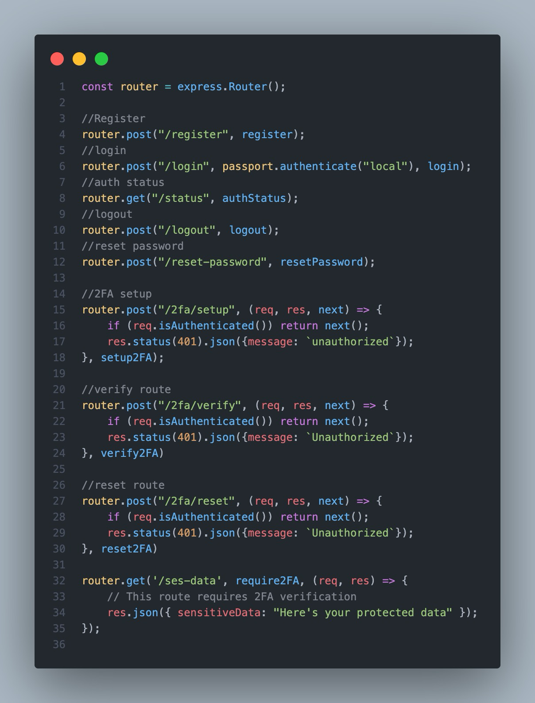
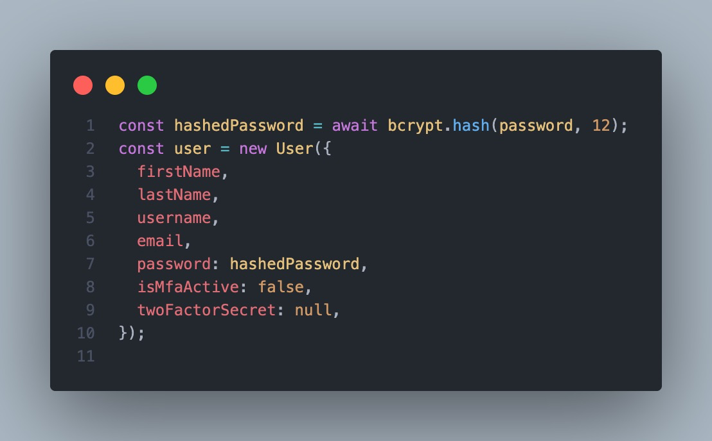
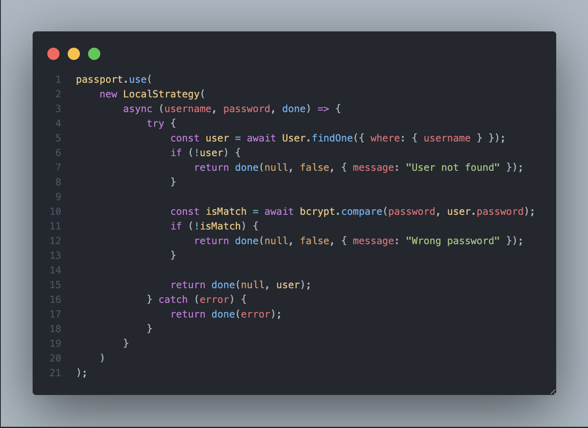
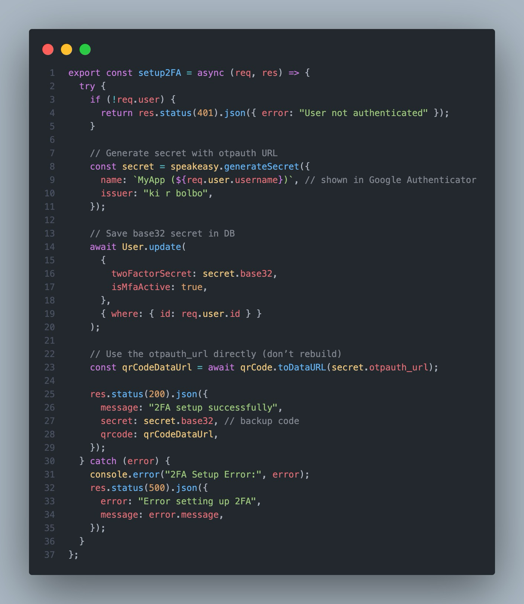
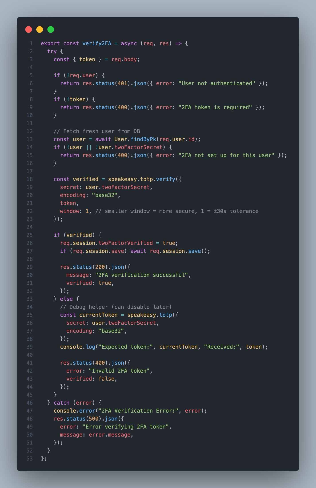

# Authentication System

A secure **Authentication System** built with **Node.js**, **Express**, **Passport.js**, **Sequelize**, and **MySQL**, featuring **password authentication**, **2FA (Two-Factor Authentication)**, and **user account management**.

---

## Features

- User registration and login with **username/email and password**
- **Two-Factor Authentication (2FA)** using **TOTP** via `speakeasy`
- Secure **password hashing** with `bcryptjs`
- Session management using **express-session**
- RESTful API endpoints for authentication and user management
- Database integration using **Sequelize ORM** with **MySQL**


## Upcoming Features

- **Email Verification**  
  Users will receive a verification email after registration to confirm their email address.
- **Forgot Password / Password Reset via Email**  
  Users will be able to reset their password through a secure link sent to their registered email.
- **Enhanced Security**  
  Additional measures such as rate limiting, account lockout on multiple failed logins, and improved session handling.
- **FrontEnd**
  Implement a robust and responsive frontend website with react.js for a better expriences. 

---

## Tech Stack

- **Backend:** Node.js, Express.js  
- **Authentication:** Passport.js (Local strategy)  
- **Database:** MySQL + Sequelize ORM  
- **Security:** bcryptjs for password hashing, speakeasy for 2FA  
- **Session Management:** express-session  
- **Development Tools:** nodemon, dotenv, body-parser, cors

---

## Installation

1. **Clone the repository**

```bash
git clone https://github.com/rimu-7/multifactor-authenticator-system-with-express-and-passportjs.git
cd multifactor-authenticator-system-with-express-and-passportjs
````

2. **Install dependencies**

```bash
npm install
```

3. **Set up environment variables**

Create a `.env` file in the root directory:

```
DB_HOST=localhost
DB_USER=root
DB_PASSWORD=your_db_password
DB_NAME=authentication_db
SESSION_SECRET=your_secret_key
PORT=4500
```

``` User Table
CREATE TABLE users (
    id VARCHAR(32) PRIMARY KEY,
    firstName VARCHAR(255) NOT NULL,
    lastName VARCHAR(255) NOT NULL,
    username VARCHAR(255) NOT NULL UNIQUE,
    email VARCHAR(255) NOT NULL UNIQUE,
    password VARCHAR(255) NOT NULL,
    isMfaActive TINYINT(1) DEFAULT 0,
    createdAt DATETIME DEFAULT CURRENT_TIMESTAMP,
    updatedAt DATETIME DEFAULT CURRENT_TIMESTAMP ON UPDATE CURRENT_TIMESTAMP,
    twoFactorSecret VARCHAR(255)
);
```

4. **Run the server**

```bash
npm run dev
```

Server will run on `http://localhost:4500`.

---

## API Endpoints

### Auth Routes

| Method | Endpoint                   | Description         |
| ------ | -------------------------- | ------------------- |
| POST   | `/api/auth/register`       | Register a new user |
| POST   | `/api/auth/login`          | User login          |
| POST   | `/api/auth/logout`         | User logout         |
| POST   | `/api/auth/2fa-verify`     | Verify 2FA code     |
| POST   | `/api/auth/reset-password` | Reset password      |

### User Routes

| Method | Endpoint           | Description                              |
| ------ | ------------------ | ---------------------------------------- |
| DELETE | `/api/user/delete` | Delete account (requires password + 2FA) |

---

## Usage

1. **Register a user**
   Send `POST` request to `/api/auth/register` with `username`, `email`, `password`, `firstName`, `lastName`.

2. **Enable 2FA**
   Use `/api/auth/2fa-setup` to generate a QR code and verify your authenticator app.

3. **Login**
   Send `POST` request to `/api/auth/login` with your `username/email` and `password`. If 2FA is enabled, provide the 2FA token.

4. **Delete Account**
   Send `DELETE` request to `/api/user/delete` with `password` and `2FA code` in the request body.

---









## Contributing & Open Source

This project is **completely open-source** and free to use for everyone.  
Feel free to **fork**, **contribute**, and submit **pull requests**.  

We welcome contributions of all kinds:
- Bug fixes 🐛  
- New features ✨  
- Documentation improvements 📚  

Please follow standard GitHub workflows for contributions:
1. Fork the repository  
2. Create your feature branch (`git checkout -b feature/FeatureName`)  
3. Commit your changes (`git commit -m 'Add some feature'`)  
4. Push to the branch (`git push origin feature/FeatureName`)  
5. Open a Pull Request  

Your contributions help make this project better for the community! 💪

---


## ❤️ Created with Love

This project was **created with love** by [Your GitHub Username](https://github.com/your-github-username).  

If you find this project useful and would like to support me, you can **donate via PayPal**: [PayPal Link](https://www.paypal.me/rimumutasim)

Thank you for your support! 🙏

---